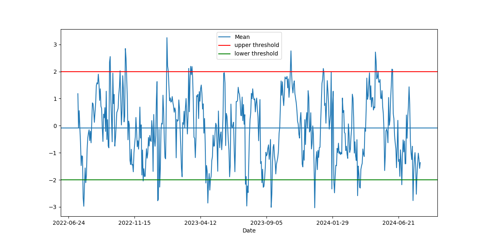

# Stocks_PairTrading with CADF test and scaling-in capital investment

## Overview
Visa and Mastercard are two of the largest payment processing companies in the world, and their stock prices often move in tandem due to their similar business models and market environments. 
For instance, if Visa's stock price increases significantly while Mastercard's remains relatively stable or declines, a pair trader might view this as an opportunity. The trader could sell (short) Visa and buy (long) Mastercard, anticipating that the prices will realign over time.

The rationale behind this trade is based on the historical correlation and the belief that the divergence in their prices is temporary. If the prices converge, the trader stands to profit from the difference. This strategy allows traders to hedge against market risk, as the positions in Visa and Mastercard can offset each other if the overall market moves against them.


Pair trading was heavily used since 1980s, and this project aims to test if it is still profitable nowadays. implements a cointegration analysis using the CADF test to assess the relationship between two stocks, Visa (V) and Mastercard (MA). 
The analysis focuses on identifying a market-neutral hedging strategy based on the spread between the cointegrated pairs.


The line and scatter plots above can show that they are highly correlated, but high correlation (close to 1 or -1) indicates that the two variables tend to move together, but it does not provide information about their long-term relationship or whether they are stationary.
Cointegration applies specifically to non-stationary time series that may drift over time but have a stable, long-term relationship.
If two non-stationary series are cointegrated, it means that despite their individual trends, they move together in a way that keeps a consistent relationship over time.

## Workflow
### Data Fetching:
Retrieves historical stock data from Yahoo Finance.

### Hedge Ratio Calculation
From the scatter plot of V vs MA or MA vs V above, the optimal hedge ratio can be found by Ordinary least squares method. In the function  `HR_cadf`. the hedge ratio is directly calculated in

```
results = sm.ols(formula=f"{series1} ~ {series2}", data=train_df[[series1, series2]]).fit()
```


### Cointegrated Augmented Dickey–Fuller Test
Augmented Dickey–Fuller (ADF) test tests the null hypothesis that a unit root is present in a time series sample. 
It makes use of the fact that if a price series has a mean-reverting behaviour, the next price level will then be proportional to the current price level.
 The ADF test will find out if λ = 0. If the hypothesis λ = 0 can be rejected, that means the next move Δy(t) depends on the current level y(t − 1), and therefore it is not a random walk. 


$$\Delta y(t) = \lambda y(t - 1) + \mu + \beta t + \alpha_1 \Delta y(t - 1) + \ldots + \alpha_k \Delta y(t - k) + \epsilon_t$$

where $$Δy(t) ≡ y(t) − y(t − 1), Δy(t − 1) ≡ y(t − 1) − y(t − 2) $$


The test statistic is the regression coefficient λ (with y(t − 1) as the independent variable and Δy(t) as the dependent variable) divided by the standard error of the regression fit: 

$λ/SE(λ)$.

Once a value for the test statistic is computed it can be compared to the relevant critical value for the Dickey–Fuller test. 

In the project, the order of pairing is taken into account, i.e. both `V vs MA` amd ` MA vs V` are tested. The ADF test is implemented on both pair, and it is found that the test statistic of
MA vs V is more negative, 

```
t-statistic=-3.786206

critical values: [-3.90158187 -3.33899606 -3.04643897]

pvalue=0.014141
```

This means the hypothesis ` λ  = 0` can be rejected at the 99 percent confidence level, i.e. 
the time series does not have a unit root, meaning it is stationary.


### Spread


### Half-life of Mean Reversion
In the equation above, 

$$\Delta y(t) = \lambda y(t - 1) + \mu + \beta t + \alpha_1 \Delta y(t - 1) + \ldots + \alpha_k \Delta y(t - k) + \epsilon_t$$

If f we ignore the drift βt and the lagged differences (Δy(t − 1),( …, Δy(t − k)), then it becomes recognizable as the Ornstein-Uhlenbeck formula for mean-reverting process: 

$$ dy(t) = (λy(t − 1) + μ)dt + dε$$

The analytical solution for the expected value of y(t) is known as 

$$ E(  y(t)) = y exp(λt) − μ/λ(1 − exp(λt))  $$

this tells us that the expected value of the price decays exponentially to the value −μ/λ with the half-life of decay equals to 
$$ −log(2)/λ $$

In this project, the half-life of Visa and Master pair is calculated as 14.579020 days.

### Z-Score and Scaling-in investment strategy
The half-life is further taken to be the lookback period in the calculation of rolling z-score. 


It can be seen that the z-score usually oscillate between -2 to 2. One of the trading strategy is to long the "unit" portfolio `( V - HR * MA) `when the z-score drops below -2,
and cash out it when the z-score reaches zero.
Also, we short the portfolio when the z-score reaches +2. 

However, another trading strategy is tested here. We accumulate units of the portfolio proportional to the negative Z-Score of the “unit” portfolio’s price

## Result


We find that APR = 4% with a Sharpe ratio of 0.77 for the strategy.

## Installation

Ensure you have Python and the required libraries installed. You can install the necessary packages using:

```
pip install numpy pandas matplotlib statsmodels
```

## Contributing

Feel free to fork the repository and submit pull requests for any enhancements or bug fixes.

## License

This project is licensed under the MIT License.
